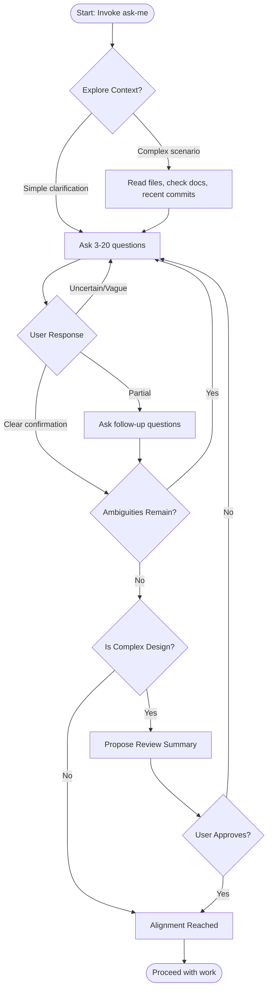

# Ask Me Skill

A skill for systematic questioning to ensure alignment before proceeding with work.

## When to Use This Skill

Trigger this skill when:
1. User explicitly says "ask me", "you ask me questions", or similar phrases
2. User is creating a plan or design solution and design details need clarification
3. User has modified a file and the intent of changes should be understood
4. Any situation where uncertainty exists about user intent
5. **YOU (the AI) are confused**: You are unsure how to execute the task, don't understand the user's goal, or lack critical information — **do NOT guess, invoke this skill immediately**
6. **User's instructions are unclear**: The request is ambiguous, missing key details, or can be interpreted in multiple significantly different ways

## Core Principles

1. **Question Iteratively**: Ask questions until alignment is reached
2. **First Round Questions**: Ask between 3-20 questions in the first round (when no prior questioning context exists)
3. **Continuous Questioning**: Continue questioning in subsequent rounds until intent is fully understood
4. **Hybrid Alignment Detection**: Infer alignment when the user gives clear confirmation (yes, correct, that's right), but explicitly ask "Are we aligned?" when uncertain

## Questioning Strategy

### For Plans and Designs

When the user is creating a plan or design:
- Explore the full branch of the design tree
- Ask about specific implementation details
- Clarify edge cases and constraints
- Understand success criteria

**Example questions:**
- What are the key constraints for this solution?
- Which parts of the design are flexible vs. fixed?
- What does success look like for this implementation?
- Are there edge cases we should consider?

### For File Modifications

When reviewing file changes:
- Focus on significant changes (ignore whitespace and minor style edits)
- Ask about the intent behind each meaningful modification
- Point out contradictions immediately if detected

**Example questions:**
- What was the reason for modifying this function?
- Why was this particular approach chosen?
- I see you changed X here, but earlier you mentioned Y - can you clarify?

### When User Says "Ask Me"

- Start with 3-20 relevant questions based on context
- Cover the main aspects of what needs to be understood
- Continue with follow-up questions until alignment

### When AI is Confused or Instructions are Unclear

**This is a mandatory trigger — do NOT guess and proceed.** When you encounter any of the following, invoke this skill immediately:

- You are unsure what the user wants you to do
- The request has multiple plausible interpretations that lead to very different outcomes
- Critical information is missing (scope, target file, expected behavior, constraints)
- You find yourself about to make an assumption just to move forward

**How to ask:**
1. State concisely what you are confused about: "I'm unclear about X"
2. If there are 2-3 distinct interpretations, list them explicitly and ask the user to choose
3. If information is simply missing, ask the specific question needed

**Example questions:**
- "I'm not sure which files you want me to modify — did you mean A or B?"
- "This could mean X or Y — which did you intend?"
- "I'm missing [specific info] before I can proceed. Can you clarify?"

**Anti-pattern to avoid:** Picking one interpretation, executing it, then asking "Is this what you meant?" — this wastes time and may cause unwanted changes.

## Handling User Responses

### Confirmation Signals (inferred alignment)
- "Yes", "correct", "that's right", "exactly"
- "Agreed", "sounds good", "that works"
- Nod emojis or clear affirmative statements

### Uncertainty Signals (explicit alignment check needed)
- "I think so", "maybe", "not sure"
- "Hmm", "let me think", vague responses
- Partial or qualified agreement ("yes, but...")
- Any response that leaves ambiguity

### Contradictions
- **Point out immediately**: If you detect a contradiction in the user's responses, flag it right away
- Example: "Earlier you mentioned X, but now you're saying Y. Can you help me understand how these fit together?"

## When to Stop Questioning

Stop when:
1. User gives clear, consistent confirmation signals
2. No significant ambiguities remain
3. All key design branches have been explored
4. You receive an explicit "we're aligned" or similar

---

## Complex Scenarios: Design Review Flow

For complex design scenarios (multi-file changes, architecture decisions, new features), follow this structured review process:



### Review Summary (Complex Scenarios Only)

When handling complex designs, after alignment is reached, present a brief review summary:

```
## Review Summary

**Understanding:**
- [One sentence summary of what we're building]

**Key Decisions:**
- Decision 1: [brief description]
- Decision 2: [brief description]
- ...

**Constraints:**
- [List of key constraints identified]

**Next Steps:**
1. [First action item]
2. [Second action item]
```

**When to use review summary:**
- Multi-file modifications (3+ files)
- Architecture-level changes
- New feature implementations
- Refactoring with design implications

**When to skip review summary:**
- Simple clarifications
- Single-file edits
- Bug fixes with clear scope
- Configuration changes

---

## Interaction Tool: AskUserQuestion

**AskUserQuestion** 是本 skill 与用户进行交互的主要工具。

### 工具功能

| 功能 | 说明 |
|------|------|
| 提问交互 | 向用户提出结构化问题 |
| 选项选择 | 提供单选/多选选项（最多3个） |
| 自由输入 | 自动提供 "Other" 选项允许用户输入自定义答案 |
| 预览模式 | 支持 preview 字段展示可视化内容（代码/界面） |
| 并行提问 | 支持一次提出多个问题（1-4个） |

### 参数说明

```yaml
questions:
  - question: "要问用户的问题"           # 问题文本，必须以问号结尾
    header: "简短标签"                    # 最多12字符，显示为芯片/标签样式
    options:                             # 选项列表，2-3个选项
      - label: "选项标题"                 # 简短描述，1-5词
        description: "详细说明"          # 解释此选项的含义和影响
        preview: "预览内容（可选）"       # 可视化展示的代码/界面/图表
    multiSelect: false                   # true=多选，false=单选
```

### 使用规则

| 规则 | 说明 |
|------|------|
| **问题数量** | 每次 1-4 个问题 |
| **选项数量** | 每个问题 **2-3 个选项**（自动添加 "Other"） |
| **自由输入** | 每个问题自动提供 "Other" 选项 |
| **Preview 支持** | 仅单选问题支持，触发侧边对比布局 |

### 何时使用 AskUserQuestion vs 文本提问

| 场景 | 推荐方式 |
|------|----------|
| 需要从 2-3 个明确选项中选择 | AskUserQuestion |
| 多个相关问题需要一起决策 | AskUserQuestion（并行提问） |
| 可视化对比（代码、UI布局） | AskUserQuestion + preview |
| 开放式探索、理解背景 | 文本提问 |
| 单一简单确认 | 文本提问 |

### 使用示例

#### 示例 1: 单选问题（技术选型）

```python
AskUserQuestion(
    questions=[{
        "question": "Which logging framework should we use?",
        "header": "Logging",
        "options": [
            {
                "label": "loguru",
                "description": "Modern, simple logging library with less boilerplate"
            },
            {
                "label": "logging",
                "description": "Python standard library, zero dependencies"
            },
            {
                "label": "structlog",
                "description": "Structured logging with context, ideal for production"
            }
        ],
        "multiSelect": False
    }]
)
```

#### 示例 2: 多选问题（功能启用）

```python
AskUserQuestion(
    questions=[{
        "question": "Which features do you want to enable?",
        "header": "Features",
        "options": [
            {"label": "Caching", "description": "Add Redis caching layer"},
            {"label": "Async", "description": "Make operations asynchronous"},
            {"label": "Retry", "description": "Add automatic retry logic"}
        ],
        "multiSelect": True
    }]
)
```

#### 示例 3: 带 Preview 的单选（UI 布局对比）

```python
AskUserQuestion(
    questions=[{
        "question": "Which wizard layout works better for the setup flow?",
        "header": "Layout",
        "options": [
            {
                "label": "Single Page",
                "description": "All steps on one scrollable page",
                "preview": "┌─────────────────────┐\n│ Step 1             │\n├─────────────────────┤\n│ Step 2             │\n├─────────────────────┤\n│ Step 3             │\n└─────────────────────┘"
            },
            {
                "label": "Multi Step",
                "description": "One step per page with navigation",
                "preview": "┌─────────────────────┐\n│ Step 1 of 3        │\n│ [Next →]           │\n└─────────────────────┘"
            },
            {
                "label": "Accordion",
                "description": "Expandable sections, progress visible",
                "preview": "┌─────────────────────┐\n│ ▼ Step 1           │\n│   Step 2           │\n│   Step 3           │\n└─────────────────────┘"
            }
        ],
        "multiSelect": False
    }]
)
```

#### 示例 4: 并行提问（多个相关决策）

```python
AskUserQuestion(
    questions=[
        {
            "question": "Should we include type hints in the codebase?",
            "header": "Type Hints",
            "options": [
                {"label": "Yes", "description": "Add type hints for better IDE support"},
                {"label": "No", "description": "Skip type hints for simplicity"}
            ],
            "multiSelect": False
        },
        {
            "question": "Which testing framework do you prefer?",
            "header": "Testing",
            "options": [
                {"label": "pytest", "description": "Modern, feature-rich testing framework"},
                {"label": "unittest", "description": "Python standard library, no dependencies"}
            ],
            "multiSelect": False
        }
    ]
)
```

### 最佳实践

1. **推荐选项优先**：如果有一个明显更好的选择，将其放在第一位并标注 "(Recommended)"
2. **Description 要具体**：说明选项的含义和权衡，不只是重复 label
3. **Preview 用于可视化**：ASCII 图表、代码片段、UI mockup 等视觉内容
4. **问题要完整**：确保问题本身包含足够上下文，用户不需要翻看聊天记录

## Important Notes

- **不要猜测再执行**：如果你不确定用户的意图，永远优先调用此 skill 提问，而不是假设一种解读然后执行。错误的执行比多问一个问题代价高得多。
- This skill does NOT remember preferences across sessions - each conversation starts fresh
- Be respectful of the user's time - ask focused, relevant questions
- If the user seems frustrated or impatient, briefly explain why the question matters and move on
- Adapt question count based on complexity - simpler tasks need fewer questions
